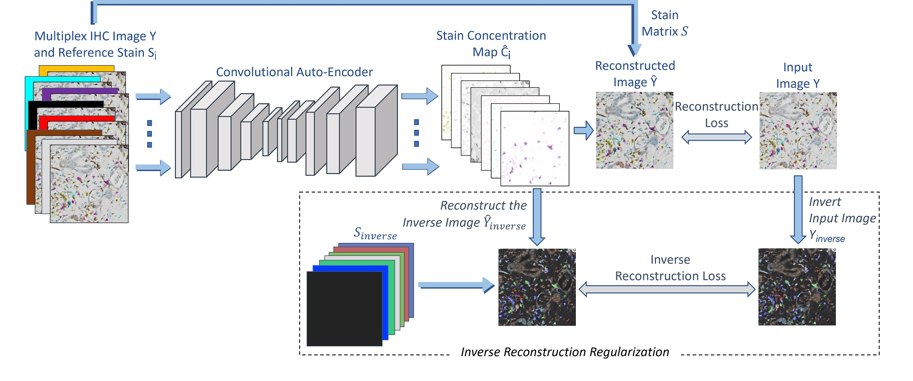

Model Training and Test
--------------------------------

<figure>
  

 
  <figcaption style="font-weight:bold;text-align:center">InverseAE Model Architecture</figcaption>

</figure>

 

### Config Files
* A config file is used for either training or testing.  
* Sample config files are located in `config_multiplex_ae1.0_val, config_multiplex_ae1.0_test, and  config_multiplex_ae1.0_train`.

### Main configurable parameters in a config file:

[DEFAULT]  
`mode`: takes values 'train' or 'test'.  
`model_path`: path of the training output folder. Model checkpoints are saved in this folder.  
`model_base_filename`: the prefix to give the model checkpoint filename.  
`model_restore_filename`: comment out if training from scratch. Otherwise set to the fullpath of the model to restore.  

[NETWORK]
`stain_init_name`: the name of the set of reference stain vectors that is used as key to retrieve the stains in the network class.  
`n_stains`: number of stains in the image. 

[COST]
`lambda_inv`: weight of the inverse regularization loss. default = 1.

[TRAIN\_DATA], [VALIDATE\_DATA], [TEST\_DATA]  
`filepath_data`: folder path containing training images.  
`filepath_label`: set to same value as `filepath_data`.  
`input_img_height`: final height of image to input to model. In [TEST\_DATA] we do not change the input size and set it to -1 accordingly.  
`input_img_width`: final width of image to input to model. In [TEST\_DATA] we do not change the input size and set it to -1 accordingly.  
`pad_y`: input padding in y dimension. We do not use same convolution, so we add padding to make output height the same size as `input_img_height`.  
`pad_x`: input padding in x dimension. We do not use same convolution, so we add padding to make output width the same size as `input_img_width`.  
Rest of the parameters are for specifying augmentation, preprocessing, and postprocessing parameters if used.

[TRAINER]  
`optimizer_type`: takes values 'ADAM' or 'SGD'.  
`max_epochs`: Number of training epochs.  
`learning_rate`: learning rate.  
`batch_size`: batch size.  
`display_step`: save loss every <`display_step`> iterations.  
`save_best_only`: takes values 'True' or 'False'. When True, saves model checkpoint only when their is improvement in loss. When False, saves model checkpoint every epoch.  
`validate_step`: running validation and possibly save model checkpoint every <`validate_step`> epochs. Default = 10.  

[TESTER]  
`out_dir`: folder path to save output predictions.  
`batch_size`: batch size.  
  

### Other preparations for training and test:

* **To change the set of reference stain vectors:**

	1. In `NNFramework_PyTorch/sa_networks/multiplex_autoencoder_fixed_stains_arch3_next3_input_stain.py`, add the reference stain color vectors in the dictionary `self.stains_dict`.   
	2. Set the key to the stain dictionary name set in used in `config -> [NETWORK] -> stain_init_name`.  
	3. Set the number of stains `config -> [NETWORK] -> n_stains`.  

	Note that the stains must contain an entry that represents the background color.

* **Training data preparation:**  
We extracted slightly overlapping patches of 400x400 at 20x  magnification. During training these patches are scaled to 263x263 by the dataloader. 

* **Test data preparation:**  
The test patches are extracted at 20x magnification. No scaling is performed during inference.

  
### Running training and test:
`cd NNFramework_Pytorch_external_call`  
`CUDA_VISIBLE_DEVICES='1' nohup  python ./external_run.py <config file path> 0  >> <output log file path>&`  
**example:**  
`cd NNFramework_Pytorch_external_call`  
`CUDA_VISIBLE_DEVICES='1' nohup  python ./external_run.py ../NNFramework_PyTorch/config_multiplex_ae1.0_train/config_multiplex-ae_rgb2stains_simple-w-mp3_nocrop_inv_aux_task_input_stain_wsi2_split1.ini 0  >> /mnt/data05/shared/sabousamra/mihc/checkpoints/rgb2stains_inv_aux_task_input_stain_wsi2_split1/log.txt&`  

