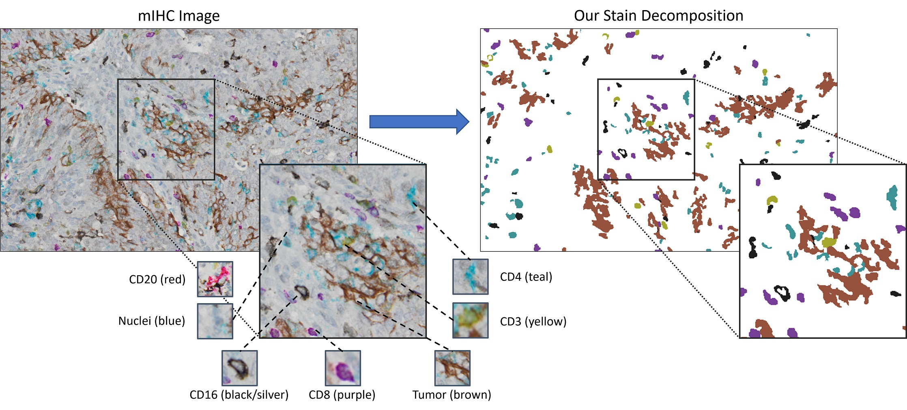

# InverseAE
### Unsupervised Stain Decomposition via Inversion Regulation for Multiplex Immunohistochemistry Images, MIDL 2023 (Oral) ###

[**Shahira Abousamra, Danielle Fassler, Jiachen Yao, Rajarsi Gupta, Tahsin Kurc, Luisa Escobar-Hoyos, Dimitris Samaras, Kenneth Shroyer, Joel Saltz, Chao Chen, Unsupervised Stain Decomposition via Inversion Regulation
for Multiplex Immunohistochemistry Images, MIDL 2023.**](https://openreview.net/pdf?id=J0VD-I2IOOg)

Multiplex Immunohistochemistry (mIHC) is a cost-effective and accessible method for in~situ labeling of multiple protein biomarkers in a tissue sample. By assigning a different stain to each biomarker, it allows the visualization of different types of cells within the tumor vicinity for downstream analysis. However, to detect different types of stains in a given mIHC image is a challenging problem, especially when the number of stains is high. Previous deep-learning-based methods mostly assume full supervision; yet the annotation can be costly. In this paper, we propose a novel unsupervised stain decomposition method to detect different stains simultaneously. Our method does not require any supervision, except for color samples of different stains. A main technical challenge is that the problem is underdetermined and can have multiple solutions. To conquer this issue, we propose a novel inversion regulation technique, which eliminates most undesirable solutions. On a 7-plexed IHC image dataset, the proposed method achieves high quality stain decomposition results without human annotation.

<figure>
  

 
  <figcaption style="font-weight:bold;text-align:center">Multiplex IHC Stain Segmentation</figcaption>

</figure>

 
  
  
- **Environment set up**: 
The code was tested with the following package installations:

Python 3.7.12  
Pytorch 1.0.1 (higher version such as 1.4.0 are expected to work as well)  
Numpy 1.21.5  
scikit-image 0.19.1  
OpenCV 4.6.0 (we are only using basic functions, other versions may just as well)  
Scipy 1.7.3  
TorchMetrics 0.11.1 (for evaluation of LPIPS metric)

- **Model training and inference**: refer to `NNFramework_PyTorch/readme.md`.

- **Output visualization and postprocessing**: refer to `src_postprocess/readme.md`.

- **Output evaluation**: refer to `src_eval_metric/readme.md`.

### Citation ###
	@InProceedings{Abousamra-2023-MIDL,
    author    = {Abousamra, Shahira and Fassler, Danielle and Yao, Jiachen and Gupta, Rajarsi and Kurc, Tahsin and Escobar-Hoyos, Luisa and Samaras, Dimitris and Saltz, Joel and Chen, Chao},  
    title     = {Unsupervised Stain Decomposition via Inversion Regulation for Multiplex Immunohistochemistry Images},  
    booktitle = {Proceedings of the IEEE/CVF International Conference on Computer Vision (ICCV)},  
    year      = {2021},  
	}
 
